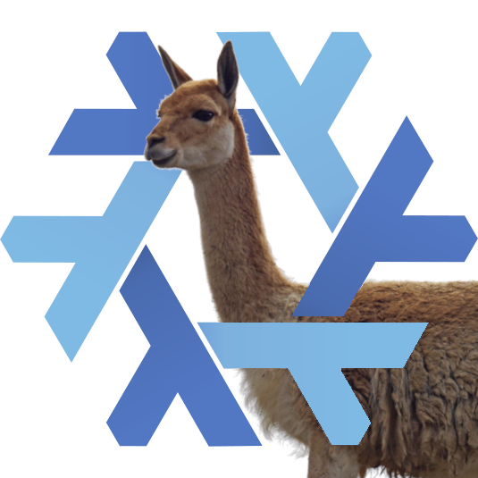

Hello everyone, we are [Tristan Ross](https://github.com/RossComputerguy) and [Weijia Wang](https://github.com/wegank), the release managers for the newest release of NixOS known as NixOS 24.11 Vicuña. We're glad to announce that after the additional week-long delay that we can deliver this stable release of NixOS.

NixOS is a Linux distribution, whose set of packages can also be used on other Linux systems and macOS.

This release will receive bugfixes and security updates for seven months (up until 2025-06-31).

- [Release manual](/manual/nixos/stable/release-notes.html#sec-release-24.11)
  - [Highlights](/manual/nixos/stable/release-notes.html#sec-release-24.11-highlights)
  - [New Services](/manual/nixos/stable/release-notes.html#sec-release-24.11-new-services)
  - [Backward Incompatibilities](/manual/nixos/stable/release-notes.html#sec-release-24.11-incompatibilities)
  - [Other Notable Changes](/manual/nixos/stable/release-notes.html#sec-release-24.11-notable-changes)
- [Upgrade Instructions](/manual/nixos/stable/index.html#sec-upgrading)
- [ISO Image Downloads](/download)

The 24.11 release was made possible due to the efforts of **2669** contributors, who authored **49079** commits since the previous release.
Our thanks go the contributors who also take care of the continued stability and security of our stable release.

NixOS is already known as [the most up to date distribution](https://repology.org/repositories/statistics/newest) while also being [the distribution with the most packages](https://repology.org/repositories/statistics/total). This release saw **8141 new** packages and **20975 updated** packages in Nixpkgs. We also **removed 3970** packages in an effort to keep the package set maintainable and secure.
In addition to packages the NixOS distribution also features modules and tests that make it what it is. This release brought **119 new** modules and **removed 30**. In that process we **added 1706** options and **removed 556**.

### GNOME 47

GNOME has been updated to version 47 "Denver", which introduces accent colors, small screen support, screen capture hardware encoding, and more changes. Refer to the [release notes](https://release.gnome.org/47/) for more details.

### Plasma 6

Plasma has been updated to version 6.2, which introduces many bug fixed and other changes. Refer to the [release notes](https://kde.org/announcements/plasma/6/6.2.3/) for more details.

### Darwin Rework

[Emily](https://github.com/emilazy), [Randy Eckenrode](https://github.com/reckenrode), and [toonn](https://github.com/toonn) did an amazing job with their work as the Darwin core maintainers to bring better support for Darwin into Nixpkgs. A comprehensive list of changes can be found on the NixOS Discourse under ["The Darwin SDKs have been updated"](https://discourse.nixos.org/t/the-darwin-sdks-have-been-updated/55295).

### C Compilers

LLVM has been updated to version 19 and GCC remains the same version. [Tristan Ross](https://github.com/RossComputerguy) made many changes which improves the way we provide multiple versions of LLVM.

## Special thanks

We want to personally thank [seth](https://github.com/getchoo/) and [Priyanshu Tripathi](https://github.com/GetPsyched) for editorializing the release notes, [lennart](https://github.com/riotbib) for doing the release logo, [Vladimír Čunát](https://github.com/vcunat) for his tireless effort in managing jobsets and staging cycles, [Martin Weinelt](https://github.com/mweinelt) for dutifully tending to our build infrastructure, and [Cole Helbling](https://github.com/cole-h) for his effort on keeping [ofBorg](https://github.com/NixOS/ofborg/) running.

### Reflections and Closing

We are thankful for everyone who contributed and everyone who was patient for 24.11. It has been a great time working with everyone to make this release possible. We hope everyone is looking forward to the next release, NixOS 25.05 Warbler.
