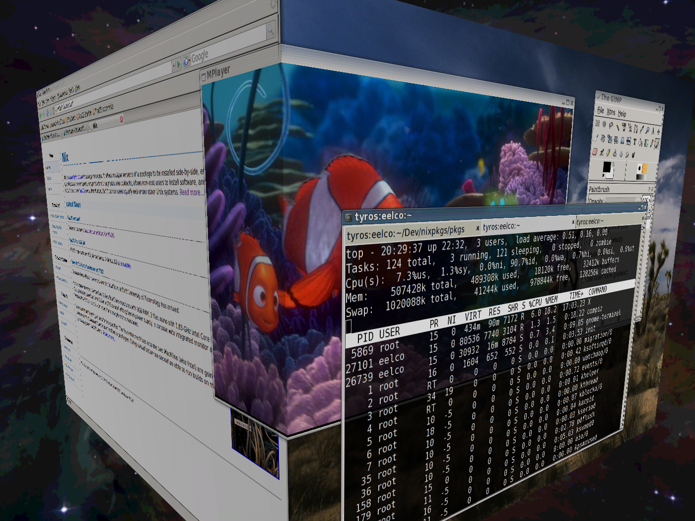

  NixOS is now _almost_ usable as a desktop OS ;-). We have an X server, a bunch of Gnome packages, basic wireless support, and of course all the applications in Nixpkgs that we had all along running on other Linux distributions. Here are a few screenshots:

*   [X server with Compiz window manager](../../../assets/image/screenshots/nixos-compiz-cube.png).
*   [Emacs and a few terminals](../../../assets/image/screenshots/nixos-terminals.png) showing off the (near) absence of /lib, /bin etc.; everything is in the Nix store.
*   [Some applications](../../../assets/image/screenshots/nixos-apps.png).
