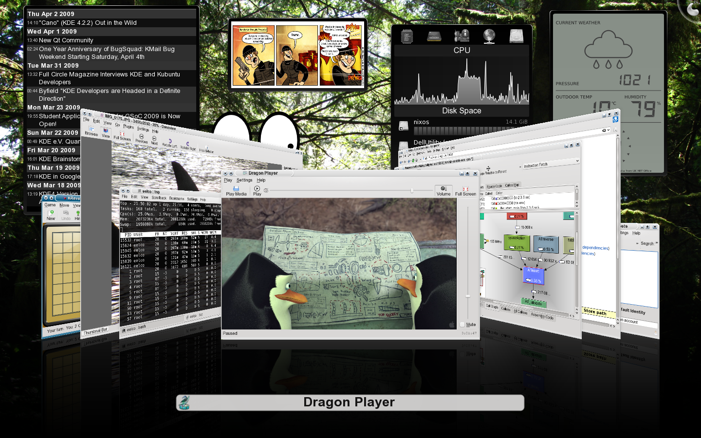

  We now have a fairly complete set of KDE 4.2 packages in Nixpkgs and NixOS. Previously we had KDE 3.5, but it was rather incomplete: just kdelibs and kdebase. Now we have all that desktop goodness, such as kdemultimedia, kdenetwork and kdegames. You can enable KDE 4 in NixOS by setting the services.xserver.sessionType option to kde4. Thanks go to Yury G. Kudryashov, Andrew Morsillo and Sander van der Burg for doing the hard work on adding KDE 4 to Nixpkgs. ([Screenshot 1](../../../assets/image/screenshots/nixos-kde42-1.png), [screenshot 2](../../../assets/image/screenshots/nixos-kde42-2.png))
