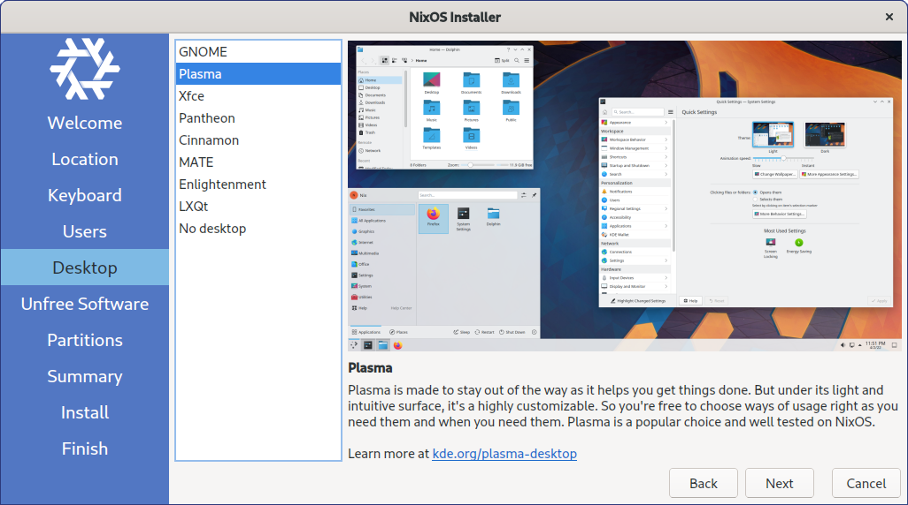

Hey everyone, I'm [Janne Heß](https://github.com/dasJ), the release manager for 22.05. As promised, the latest stable release is here: NixOS 22.05 “Quokka”.

*   [Release manual](/manual/nixos/stable/release-notes.html#sec-release-22.05)
    *   [Highlights](/manual/nixos/stable/release-notes.html#sec-release-22.05-highlights)
    *   [New Services](/manual/nixos/stable/release-notes.html#sec-release-22.05-new-services)
    *   [Backward Incompatibilities](/manual/nixos/stable/release-notes.html#sec-release-22.05-incompatibilities)
    *   [Other Notable Changes](/manual/nixos/stable/release-notes.html#sec-release-22.05-notable-changes)
*   [Upgrade Instructions](/manual/nixos/stable/index.html#sec-upgrading)
*   [Image downloads](/download)

The 22.05 release was possible due to the efforts of **1611** contributors in **46727** commits. We would especially like to thank our top 10 contributors: [Fabian Affolter](https://github.com/fabaff), [Sandro Jäckel](https://github.com/supersandro2000), [Martin Weinelt](https://github.com/mweinelt), [Bobby Rong](https://github.com/bobby285271), [Mario Rodas](https://github.com/marsam), [Jonathan Ringer](https://github.com/jonringer), [Jan Tojnar](https://github.com/jtojnar), [Jörg Thalheim](https://github.com/mic92), [sternenseemann](https://github.com/sternenseemann), and [Robert Schütz](https://github.com/dotlambda).

NixOS is already known as [the most up to date distribution](https://repology.org/repositories/statistics/newest) and is [the distribution with the most packages](https://repology.org/repositories/statistics/total). This release saw **9345 new** packages and **10666 updated** packages. Removal of unmaintained packages is also important to keep the package set working and secure. This release **removed 5874** packages that were available in 21.11.
nixpkgs also includes a lot of modules that make NixOS what it is. This release brought **89 new** modules and **removed 27**. In that process, the contributors **added 1304** options and **removed 359**.

### Nix 2.8

This release brings nix 2.8 as the default nix package. This brings users a lot of fixes, general improvements and increased performance. The main feature that was awaited for a long time is the introduction of experimental features, namely the **flakes** experimental feature. Users still have to opt into the feature manually (as well as the **nix-command** feature that was enabled by default in previous nix versions).

### Graphical installer

 Improving experience for new users is something that the NixOS project has been working on for a long time. After all, NixOS is a very different compared to traditional distributions. To make it easier to get started with a new NixOS system, a graphical installer based on [Calamares](https://calamares.io) is now provided. This installer starts by default when launching the GNOME or Plasma ISO and allows for one-time configuration of a new system.

### Special Thanks

Thanks to [Jörg Thalheim](https://github.com/Mic92) who helped with the changelog as the release editor. Also to [Jon Ringer](https://github.com/jonringer) for guiding the release process since NixOS 20.09. [Vladimír Čunát](https://github.com/vcunat) and [Martin Weinelt](https://github.com/mweinelt) for their continued efforts managing and stabilizing staging. More thanks go out to [Martin Weinelt](https://github.com/mweinelt) for helping me with a lot of questions about the process and some subsystems, your help was greatly appreciated. Also thanks a lot to [Graham Christensen](https://github.com/grahamc) for organizing with [Equinix Metal](https://metal.equinix.com/) to ensure we had enough compute resources and the entire infrastructure team.
Additional thanks go out to [Rick van Schijndel](https://github.com/Mindavi) for going through all the pain of marking packages that do not build anymore as broken. I hope we can make the process more straightforward in future releases.

### Reflections and Closing

This release brought a lot of features and improvements I've been waiting to see in a release channel. It was a great pleasure working with the community and seeing incredible amounts of work being done by the entire community.
